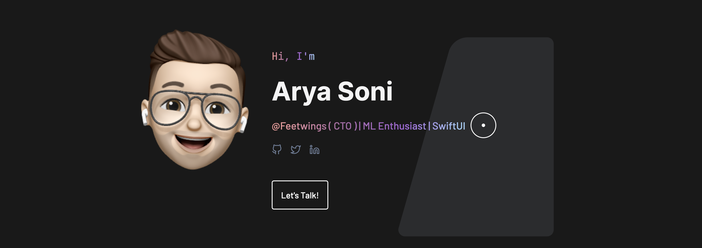

[;ML+Enthusiast)](https://git.io/typing-svg)

  

  

  

- 🔭 I’m currently working on [AI Interview System](https://github.com/aryasoni98/AI-Interview)

- 🌱 I’m currently learning **Deep Learning, ML Algorithm, NLP**

- 👯 I’m looking to collaborate on [PaperTxT](https://github.com/shubhigupta991/PaperTxT)

- 🤝 I’m looking for help with [Restaurant App](https://github.com/wizbeans/Restaurant-App)

- 👨‍💻 All of my projects are available at [https://aryasoni98.github.io/](https://aryasoni98.github.io/)

- 📝 I regularly write articles on [https://blog.aryasoni.com/](https://blog.aryasoni.com/)

- 💬 Ask me about **Git, React, JavaScript, AWS, Deploy etc**

- 📫 How to reach me **aryasoni98@gmail.com**

---

<h3 align="left">Connect with me:</h3>

---

<h3 align="left">Languages and Tools:</h3>

                                        

---

&nbsp;

---

<h3 align="left">Daily Dev</h3>

 

---

<h3 align="left">Support:</h3>

  

---

Detailed Summary

 

![Metrics](https://metrics.lecoq.io/aryasoni98?template=classic&repositories.forks=true&isocalendar=1&languages=1&introduction=1&habits=1&licenses=1&contributors=1&stars=1&topics=1&gists=1&followup=1&lines=1&traffic=1&projects=1&activity=1&achievements=1&support=1&skyline=1&tweets=1&people=1&posts=1&stargazers=1&pagespeed=1&isocalendar.duration=full-year&languages.limit=8&languages.sections=most-used&languages.colors=github&languages.threshold=0%25&languages.indepth=true&languages.recent.load=300&languages.recent.days=14&introduction.title=true&habits.from=200&habits.days=14&habits.facts=true&habits.charts=false&licenses.ratio=true&licenses.legal=true&contributors.head=master&contributors.ignored=github-actions%5Bbot%5D%2C%20dependabot%5Bbot%5D%2C%20dependabot-preview%5Bbot%5D&contributors.contributions=false&stars.limit=4&topics.mode=mastered&topics.sort=stars&topics.limit=15&people.limit=24&people.size=28&people.types=followers%2C%20following&people.identicons=true&people.shuffle=true&followup.sections=repositories&projects.limit=4&projects.descriptions=true&activity.limit=5&activity.load=300&activity.days=14&activity.filter=all&activity.visibility=all&activity.timestamps=false&achievements.threshold=C&achievements.secrets=true&achievements.limit=0&skyline.year=2020&skyline.frames=60&skyline.quality=0.5&skyline.compatibility=true&pagespeed.url=.user.website&pagespeed.detailed=true&pagespeed.screenshot=true&tweets.attachments=false&tweets.limit=2&posts.source=hashnode&posts.descriptions=false&posts.covers=false&posts.limit=4&posts.user=.user.login&config.timezone=Asia%2FCalcutta)

